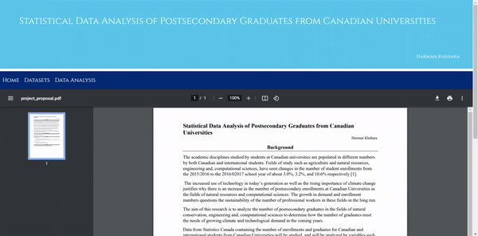
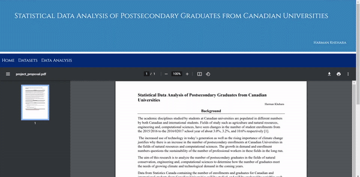
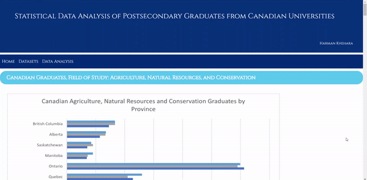

# Statistical Data Analysis of Postsecondary Graduates from Canadian Universities :bar_chart:

This repository is dedicated to the files associated with my personal research project.

The findings of this research project are presented on the following <a target="_blank" href="https://harman-khehara.github.io/">website,</a> all supplementary files, including python and R scripts can be found in <a href="https://github.com/harman-khehara/harman-khehara.github.io">this</a> repository.

The aim of this research is to analyze the number of Canadian and internatioanl postsecondary graduates in the fields of natural conservation, engineering and, computational sciences to determine how the number of graduates meet the needs of growing climate and technological demand in the coming years.

<h2>Table of Contents</h2>

<a href="#data">Data Analysis</a>

<a href="#website">Website Development</a>

<a href="#installation">Installation Requirements</a>

<a href="#contributors">Contributors</a>

<p"><a href="#notes">Notes</a>

<h2 id="data">Data Analysis</h2>

All datasets for this project were obtained from <a href="https://www150.statcan.gc.ca/t1/tbl1/en/tv.action?pid=3710002001">Statistics Canada</a> and downloaded as <b>csv files</b>.

I wrote <b>python scripts</b> to automate the process of manipulating the csv files. In addition, I used python and the <a href="https://pandas.pydata.org/"><b>pandas</b></a> software library to create a program which can convert the csv files to an HTML table which can be used to display the csv files on the follwing <a target="_blank" href="https://harman-khehara.github.io/">website.</a>

The data analysis of the csv files was conducted using both <b>Microsoft Excel</b> and <b>R/RStudio</b>. I created <b>relevant graphs</b>, <b>boxplots</b> and obtained the <b>summary statistics</b> for each dataset to conduct the analysis.

<h2 id="website">Website Development</h2>

This website to display the findings of my research was developed using <b>HTML5</b>, <b>CSS3</b> and the <a href="https://getbootstrap.com/"><b>Bootstrap</b></a> CSS framework to help create a responsive design. The website was developed in <b>VSCode</b>

<table>
      <tr>
        <th>
          
        </th>
        <th>
          
        </th>
        <th>
          
        </th>
      </tr>
</table>

<h2 id="installation">Installation Requirements</h2>

If you wish to view the code for this project, you may <code>git clone</code> this repository or simply click on the file you would like to view. This research project is summarized on the following <a target="_blank" href="https://harman-khehara.github.io/">website.</a>

<h2 id="contributors">Contributors</h2>

The research and analysis for this project, along with the code and website design was conducted by Harman Khehara.

<h2 id="notes">Notes</h2>

This is a personal research project done entirely for the purpose of my own personal development in the fields of statistcal research and web development.

